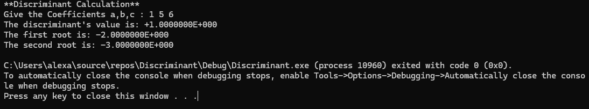
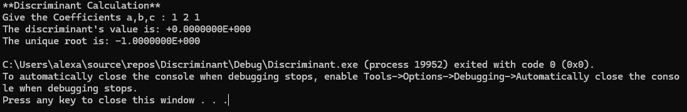
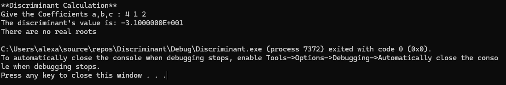

# Discriminant Calculator

A simple quadratic equation solver written in **x86 Assembly** using **MASM** and the **Irvine32 library**.

The program calculates the discriminant of a quadratic equation and, depending on its value, calculates the corresponding real roots.

## Description

The program solves a quadratic equation of the form:
**ax² + bx + c = 0**

It asks the user to enter the three coefficients:
- `a`
- `b`
- `c`

The program then calculates the discriminant:
**D = b² - 4ac**

Based on the value of `D`, the program determines the number of real roots.

### Cases

| Discriminant | Result |
|   `D > 0`    | Two distinct real roots |
|   `D = 0`    | One real root |
|   `D < 0`    | No real roots |

-------------------------

## Formulas:

`Discriminant`

**D = b² - 4ac**

`Two real roots (D > 0)`

**x₁ = (-b + √D) / 2a**

**x₂ = (-b - √D) / 2a**

`One real root (D = 0)`

**x = -b / 2a**

`No real root (D < 0)`
*we will occur complex roots:*

**x₁ = (-b + i√-D) / 2a**

**x₂ = (-b - i√-D) / 2a**

-------------------------

## Technologies:

- **x86 Assembly**
- **MASM (Microsoft Macro Assembler)**
- **Irvine32 Library**
- **x87 FPU**
- **Visual Studio**

The program uses the **x87 Floating-Point Unit** for floating-point calculations involving `REAL8` values.

-------------------------

## FPU Usage

Floating-point calculations are performed using the x87 FPU stack.

Some of the x87 instructions used are:

`asm`
fld
fst
fstp
fmul
fdivp
faddp
fsubp
fsqrt
fchs
ftst
fnstsw

`x87 FPU stack registers:`
ST(0) - ST(7)

## Examples:

